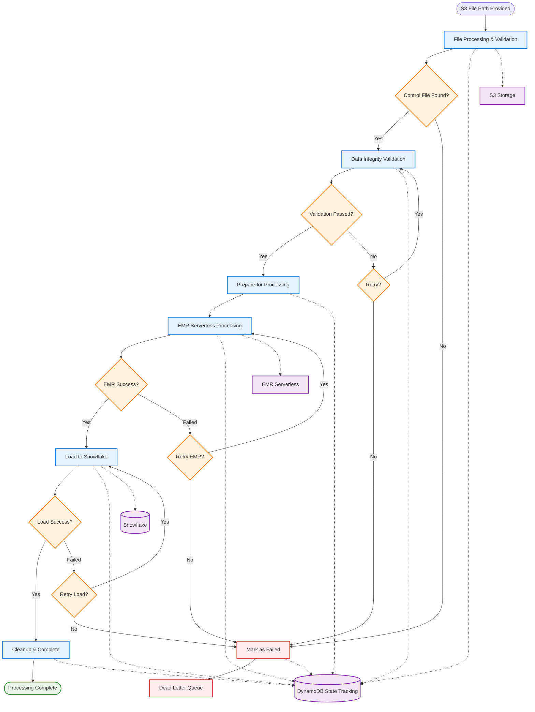

# File Orchestration Flow Diagram

This diagram shows the simplified flow of how a provided S3 file moves through the orchestration system to Snowflake loading.

## Simplified Flow Overview

### 🔄 **Main Processing Stages:**
1. **File Processing & Validation** - Process provided S3 file path and validate control files
2. **Data Integrity Validation** - Verify file integrity using control file metadata
3. **Staging** - Prepare files for EMR processing
4. **EMR Processing** - Execute PySpark job on EMR Serverless
5. **Snowflake Loading** - Load processed data into Snowflake
6. **Cleanup & Complete** - Clean up resources and mark as complete

### ⚠️ **Error Handling:**
- **Retry Logic** - Automatic retries at validation, EMR, and Snowflake stages
- **Dead Letter Queue** - Failed files that exceed retry limits
- **State Persistence** - All stages tracked in DynamoDB

### 🎯 **Key Benefits:**
- **Simplified View** - Focus on main processing stages
- **Clear Decision Points** - Easy to understand success/failure paths
- **DynamoDB Integration** - State tracking throughout the flow
- **AWS Service Integration** - Clear connections to EMR and Snowflake
- **Event-Driven Processing** - Triggered by specific S3 file paths
